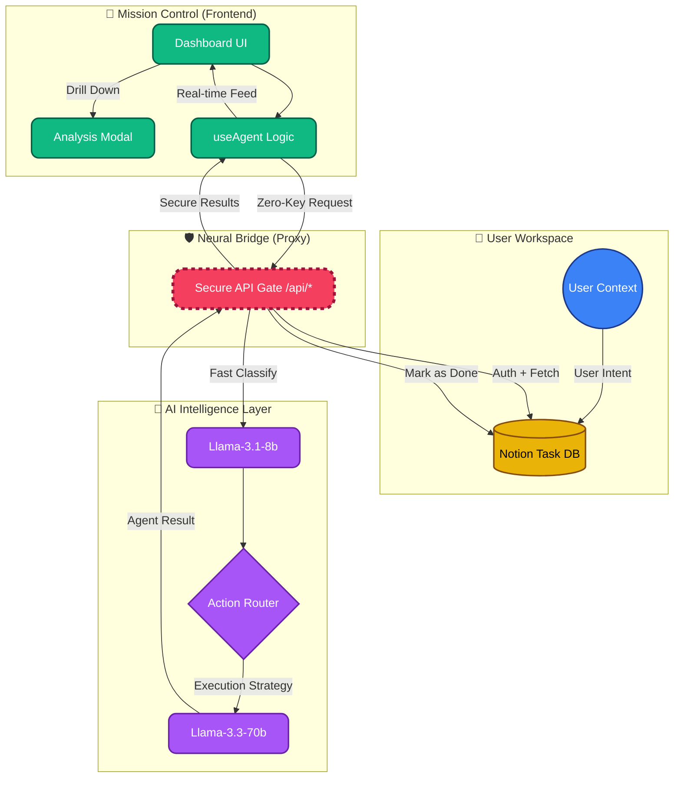

# 🏗️ AutoDesk AI Architecture

This document describes the high-level architecture of the AutoDesk AI execution agent.

## 🔄 System Flow

## 📂 Component Overview

### 1. Frontend (React + Vite)

- **`Layout.tsx`**: Shared navigation with a mobile-optimized drawer system and robust routing protection.
- **`Index.tsx`**: High-performance Landing Page featuring ultra-responsive typography and 3D mock rotations synchronized across all viewports.
- **`Dashboard.tsx`**: The "Mission Control" hub with dynamic stats and real-time activity logs.
- **`TaskIntelligenceModal`**: A specialized portal for deep-diving into pending and historical task data.
- **`useAgent.ts`**: Zero-key orchestration layer that securely communicates with the backend proxy.

### 2. Backend Proxy (Vercel Functions)

- **`api/notion.ts`**: Securely handles all Notion interactions. Bakes in the `NOTION_API_KEY` and `DATABASE_ID` on the server so they never reach the client.
- **`api/groq.ts`**: Proxies requests to Groq, injecting the `GROQ_API_KEY` server-side to prevent key leakage.

### 3. AI Intelligence (Groq API)

- **Classification Layer**: Uses `llama-3.1-8b-instant` for sub-second task parsing and JSON schema generation.
- **Production Layer**: Uses `llama-3.3-70b-versatile` for high-context reasoning and professional content generation.

### 3. Workspace Engine (Notion API)

- **Dynamic Polling**: Supports both `To Do` filtering (Active Queue) and full database scanning (Historical Timeline).
- **Temporal Metadata**: Captures `last_edited_time` to provide completion timestamps in the dashboard.
- **Verification**: Automatically transitions Notion status to `Done` upon successful agent execution.

## 🛠️ Tech Stack Constants

- **Framework**: React 18 (SPA)
- **Styling**: Tailwind CSS + Glassmorphism Design System
- **Animations**: Framer Motion (3D Rotations + Layout Transitions)
- **Connectivity**: Notion v2022-06-28 + Groq LPU™ Reference

---

## 🔗 Connect & Explore

**Developed with precision by [Babin Bid](https://github.com/KGFCH2)**  
*Neural Integration | Autonomous Systems | Motion UI*

[GitHub](https://github.com/KGFCH2) | [LinkedIn](https://linkedin.com/in/babinbid123) | [Email](mailto:babinbid05@gmail.com)
