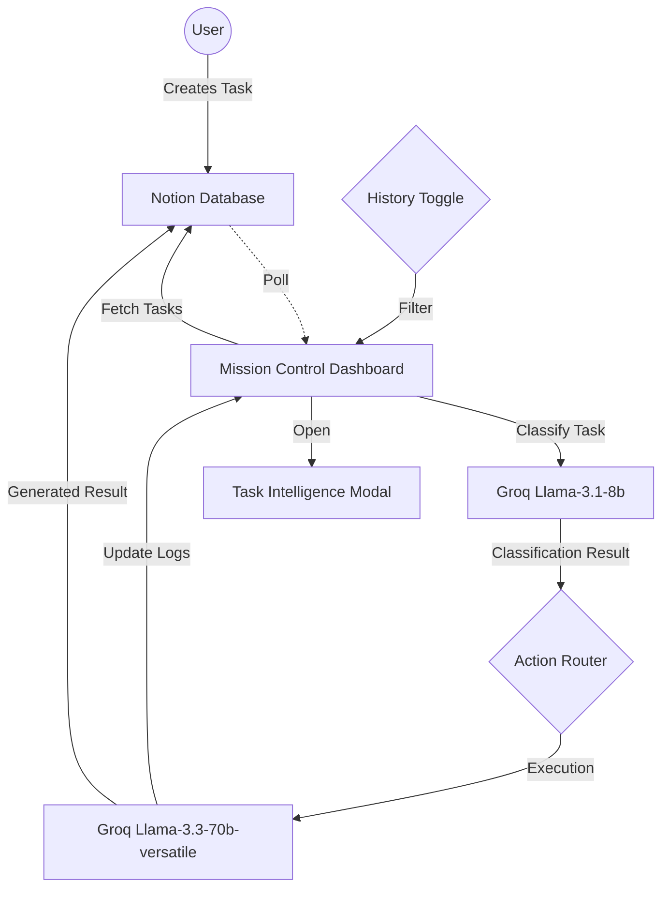

# 🏗️ AutoDesk AI Architecture

This document describes the high-level architecture of the AutoDesk AI execution agent.

## 🔄 System Flow

## 📂 Component Overview

### 1. Frontend (React + Vite)

- **`Layout.tsx`**: Shared navigation with robust redirection logic and responsive wrapper.
- **`Index.tsx`**: Modern Landing Page with ultra-wide cinematic hero and 3D product previews.
- **`Dashboard.tsx`**: The "Mission Control" hub featuring real-time stats (Success Rate, Engine Status) and streaming activity logs.
- **`TaskIntelligenceModal`**: A specialized portal for deep-diving into pending and historical task data.
- **`useAgent.ts`**: Orchestration layer managing state persistence and multi-tier AI inference.

### 2. AI Intelligence (Groq API)

- **Classification Layer**: Uses `llama-3.1-8b-instant` for sub-second task parsing and JSON schema generation.
- **Production Layer**: Uses `llama-3.3-70b-versatile` for high-context reasoning and professional content generation.

### 3. Workspace Engine (Notion API)

- **Dynamic Polling**: Supports both `To Do` filtering (Active Queue) and full database scanning (Historical Timeline).
- **Temporal Metadata**: Captures `last_edited_time` to provide completion timestamps in the dashboard.
- **Verification**: Automatically transitions Notion status to `Done` upon successful agent execution.

## 🛠️ Tech Stack Constants

- **Framework**: React 18 (SPA)
- **Styling**: Tailwind CSS + Glassmorphism Design System
- **Animations**: Framer Motion (3D Rotations + Layout Transitions)
- **Connectivity**: Notion v2022-06-28 + Groq LPU™ Reference

---

## 🔗 Connect & Explore

**Developed with precision by [Babin Bid](https://github.com/KGFCH2)**  
*Neural Integration | Autonomous Systems | Motion UI*

[GitHub](https://github.com/KGFCH2) | [LinkedIn](https://linkedin.com/in/babinbid123) | [Email](mailto:babinbid05@gmail.com)
